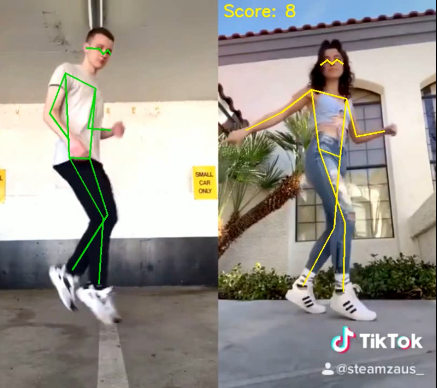

## **Virtual Coach: Self-training**

### **Main Project Objectives and Tasks**
1. **Pose Detection**: The primary goal of the Virtual Coach is to analyze human movements by detecting key body points (eyes, ears, nose and main joints) using Keypoint R-CNN model.
2. **Pose Estimation**: The system estimates test pose with a reference one and calculates score based on 13 keypoints (ears and eyes are excluded). Three scoring functions are implemented (cosine similarity, inverted weighted distance and their product).
3. **Skeleton Highlighting**: The Virtual Coach overlays skeletons on top of persons and thus highlights deviations.

### **Input Data Requirements**
This code uses OpenCV library and can process all video formats supported by this solution. Output video format is mp4.

### **Project Steps**
1. **Keypoints Detection and Skeleton Highlighting**:
    - Detect keypoints using Keypoint R-CNN model.
    - Draw skeleton over source image.
2. **Pose Estimation**:
    - Adjust estimated image by applying affine transformation.
    - Calculate scores by using cosine similarity and weighted distance.
3. **Module Creation**:
    - Create code to process source video files and write resulting one.
    - Compare detected keypoints with reference pose.

### Output Examples

1. **[Cosine Similarity](https://disk.yandex.ru/i/g-tzJi0Av8-PbA)**

2. **[Inverted Weighted Distance](https://disk.yandex.ru/i/1l13NciyfxIoXA)**

1. **[Product](https://disk.yandex.ru/i/by6IQzmHNStM-A)**

### **Installation**

<code>
git clone https://github.com/kholeu/VirtualCoach

cd VirtualCoach

pip install -r requirements.txt
</code>

This project was developed and tested in Google Colab. Input video files are available under this [link](https://drive.google.com/file/d/1ZDB4s8hJ94OWNQFXs8IILRXMeyDtv3sW/view?usp=sharing)

### **Usage**

<code>
usage: python3 vcoach.py [-h] [-b BATCH_SIZE]

                         [--score_fn {cosine_similarity,inv_weighted_distance,product}]

                         ref_videofile test_videofile out_videofile

This program estimates human movements in test video compare to the supplied reference

positional arguments:

  ref_videofile         reference video file

  test_videofile        estimated video file

  out_videofile         output video file

options:
  
  -h, --help            show this help message and exit
  
  -b BATCH_SIZE, --batch_size BATCH_SIZE
                        batch size (default: 4)
  
  --score_fn {cosine_similarity,inv_weighted_distance,product}
                        scoring function (default: product)
</code>
